
<h2>PhD Students</h2>

  
  <h5 style="margin: 0"><b>Akshita Kumar</b></h5>
  
<b>Period</b>: 02/2026 - 12/2028

  
<b>Co-superivsed with:</b> J.F. Mangin (NeuroSpin,CEA) and C Barbano (Inria)

  
<b>Title:</b> Self-supervised learning for multi-modal longitudinal brain imaging data 

  

 

  
  <h5 style="margin: 0"><b>Robin Guiavarch</b></h5>
  
<b>Period</b>: 01/2026 - 12/2028

  
<b>Co-superivsed with:</b> J.F. Mangin and D. Rivière (NeuroSpin,CEA)

  
<b>Title:</b> Modeling and Learning the Development of Cortical Folding 

  

 

  
  <h5 style="margin: 0"><b>Edgard Dabier</b></h5>
  
<b>Period</b>: 11/2025 - 11/2028

  
<b>Co-superivsed with:</b> F. Tupin and C. Kervazo (Télécom Paris)

  
<b>Title:</b> Algorithm unrolling for hyperspectral unmixing 

  

 

  
  <h5 style="margin: 0"><b>Sébastien Roig</b></h5>
  
<b>Period</b>: 10/2025 - 10/2028

  
<b>Co-superivsed with:</b> A. Laugros, A. Pacureanu (ESRF, Grenoble)

  
<b>Title:</b> Machine learning methods for automated reconstruction of neural circuits from x-ray nanotomography data 

  

 

  
  <h5 style="margin: 0"><b>Mathis Wetterwald</b></h5>
  
<b>Period</b>: 10/2025 - 10/2028

  
<b>Co-superivsed with:</b> M. Wigger (Télécom Paris), B. Dufumier (NeuroSpin, CEA)

  
<b>Title:</b> Multimodal self-supervised representation learning: an information theory perspective 

  

 

  
  <h5 style="margin: 0"><b>Chikh Abdelghani Baroud</b></h5>
  
<b>Period</b>: 10/2025 - 10/2028

  
<b>Co-superivsed with:</b> J.F. Mangin and J. Chavas (NeuroSpin,CEA)

  
<b>Title:</b> Multimodal weakly supervised Learning a foundation model of cortical folding 

  

 

  
  <h5 style="margin: 0"><b>Simon Lécluse</b></h5>
  
<b>Period</b>: 04/2025 - 04/2028

  
<b>Co-superivsed with:</b> I. Bloch (Sorbonne Université), M. Maillard, T. Estienne (Deemea)

  
<b>Title:</b> Leveraging Contextual Learning for 3D Neurological Image Retrieva 

  

 

  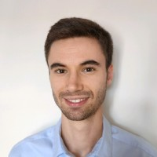
  <h5 style="margin: 0"><b>Julien Laval</b></h5>
  
<b>Period</b>: 03/2025 - 03/2028

  
<b>Co-superivsed with:</b> J.F. Mangin, D. Rivière, J. Chavas (NeuroSpin,CEA)

  
<b>Title:</b> Learning a foundation model of cortical folding 

  

 

  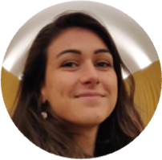
  <h5 style="margin: 0"><b>Marie Arrivat</b></h5>
  
<b>Period</b>: 01/2025 - 12/2027

  
<b>Co-superivsed with:</b> E. Angelini (Télécom Paris) and R. Peyret (Primaa)

  
<b>Title:</b> Data efficient, robust and weakly supervised learning for computational pathology

  

  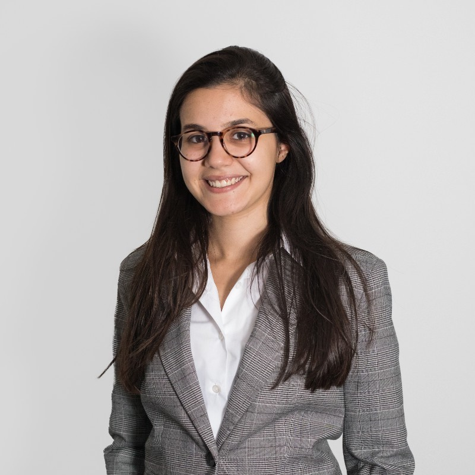
  <h5 style="margin: 0"><b>Syrine Chennoufi</b></h5>
  
<b>Period</b>: 01/2025 - 12/2027

  
<b>Co-superivsed with:</b> M. Labeau (Télécom Paris) and M. Huard (Milvue)

  
<b>Title:</b> Vision-language models for Medical Imaging

  

  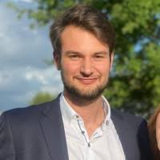
  <h5 style="margin: 0"><b>Gauthier Miralles</b></h5>
  
<b>Period</b>: 09/2024 - 09/2027

  
<b>Co-superivsed with:</b> L. Le Folgoc (Télécom Paris) and V. Jugnon (GE HealthCare)

  
<b>Title:</b> Domain adaptation for Deep Learning on interventional radiology imaging 

  

  
  <h5 style="margin: 0"><b>Mohamad Dabboussi</b></h5>
  
<b>Period</b>: 05/2024 - 05/2027

  
<b>Co-superivsed with:</b> Y. Gousseau (Télécom Paris) and M. Huard (Milvue)

  
<b>Title:</b> Multi-view fracture detection in planar X-ray

  

  
  <h5 style="margin: 0"><b>Ismaël Mounim</b></h5>
  
<b>Period</b>: 01/2023 - 06/2026

  
<b>Co-superivsed with:</b> E. Angelini (Télécom Paris), G. El Fakhri and Chao Ma (Yale Medical School)

  
<b>Title:</b> Posterior Estimation of MRI and PET parametric maps using variational auto-encoders

  

<h2>Postdocs</h2>

  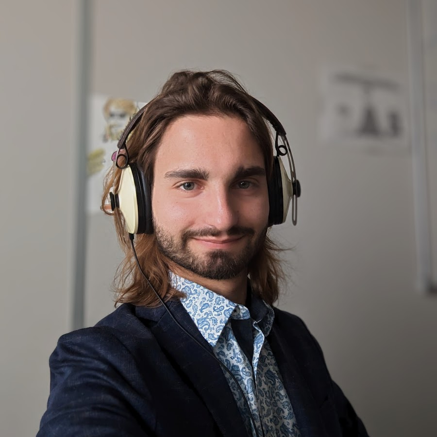
  <h5 style="margin: 0"><b>Michael Soumm</b></h5>
  
<b>Period</b>: 02/2025 - 02/2026

  
<b>Co-superivsed with:</b> A. Newson (Sorbonne Université)

  
<b>Title:</b> Diffusion models for Contrastive Analysis

  

<h2>Alumni (PhD and Postdocs)</h2>

  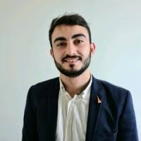
  <h5 style="margin: 0"><b>Ali Mammadov</b></h5>
  
<b>Period</b>: 10/2022 - 12/2025

  
<b>Co-superivsed with:</b> L. Le Folgoc (Télécom Paris), G. Hocquet and J. Adam (Paris Saint-Joseph hospital)

  
<b>Title:</b> Deep SjS: a deep learning approach for the diagnosis and evolution prediction of the Sjögren’s syndrome

   
<b>Now:</b> Computer Vision Research Engineer at SeeHaptic.

  

  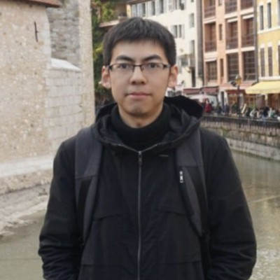
  <h5 style="margin: 0"><b>Yunlong He</b></h5>
  
<b>Period</b>: 10/2023 - 12/2025

  
<b>Title:</b> Improving GAN and Diffusion based Contrastive Analysis

   
<b>Now:</b> Post-doc.

  

  
  <h5 style="margin: 0"><b>Emma Sarfati</b></h5>
  
<b>Period</b>: 09/2022 - 06/2025

  
<b>Co-superivsed with:</b> I. Bloch (Télécom Paris), Alexandre Bône (Guerbet) and Marc-Michel Rohe (Guerbet)

  
<b>Now:</b> Machine Learning Engineer at Criteo.

  

  
  <h5 style="margin: 0"><b>Robin Louiset</b></h5>
  
<b>Period</b>: 11/2020 - 06/2024 (PhD)

  
<b>Co-superivsed with:</b> E. Duchesnay (NeuroSpin, CEA) and A. Grigis (NeuroSpin, CEA)

  
<b>Now:</b> Post-doc at DEC, ENS Ulm, Paris.

  

  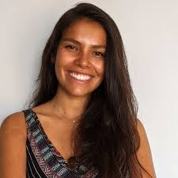
  <h5 style="margin: 0"><b>Rebeca Vetil</b></h5>
  
<b>Period:</b> 04/2021 - 04/2024 (PhD)

  
<b>Co-supervised with:</b> I. Bloch (Télécom Paris), Alexandre Bône (Guerbet), and Marc-Michel Rohe (Guerbet)

  
<b>Now:</b> AI Researcher at Guerbet.

  

  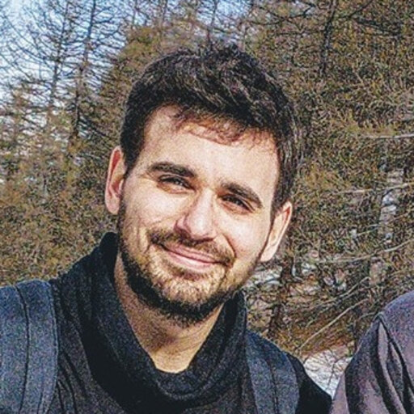
  <h5 style="margin: 0"><b>Carlo Alberto Barbano</b></h5>
  
<b>Period:</b> 10/2020 - 12/2023 (PhD)

  
<b>Co-supervised with:</b> M. Grangetto (University of Turin)

  
<b>Now:</b> Post-doc at Inria.

  

  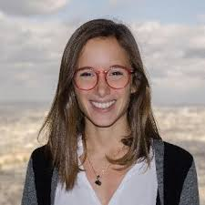
  <h5 style="margin: 0"><b>Camille Ruppli</b></h5>
  
<b>Period:</b> 01/2021 - 12/2023 (PhD)

  
<b>Co-supervised with:</b> I. Bloch (Télécom Paris) and Roberto Ardon (Incepto)

  
<b>Now:</b> Data Scientist at Incepto.

  

  
  <h5 style="margin: 0"><b>Matthis Maillard</b></h5>
  
<b>Period:</b> 10/2019 - 06/2023 (PhD)

  
<b>Co-supervised with:</b> I. Bloch  (Télécom Paris)

  
<b>Now:</b> Data Scientist at Deemea.

  

  
  <h5 style="margin: 0"><b>Anton François</b></h5>
  
<b>Period:</b> 10/2019 - 05/2023 (PhD)

  
<b>Co-supervised with:</b> J. Glaunès (MAP5)

  
<b>Now:</b> Post-doc at ENS Paris-Saclay.

  

  
  <h5 style="margin: 0"><b>Florence Carton</b></h5>
  
<b>Period:</b> 09/2021 - 01/2023 (Postdoc)

  
<b>Now:</b> Research Engineer at Total.

  

  
  <h5 style="margin: 0"><b>Benoit Dufumier</b></h5>
  
<b>Period:</b> 10/2019 - 12/2022 (PhD)

  
<b>Co-supervised with:</b> E. Duchesnay (Neurospin, CEA)

  
<b>Now:</b> CEA Researcher at Neurospin.

  

  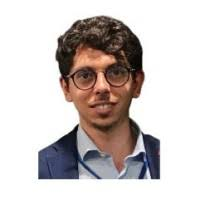
  <h5 style="margin: 0"><b>Giammarco La Barbera</b></h5>
  
<b>Period:</b> 10/2019 - 12/2022 (PhD)

  
<b>Co-supervised with:</b> I. Bloch (Télécom Paris), L. Rouet (Philips), and S. Sarnacki (Necker hospital)

  
<b>Now:</b> CTO of the Start-up Replico.

  

  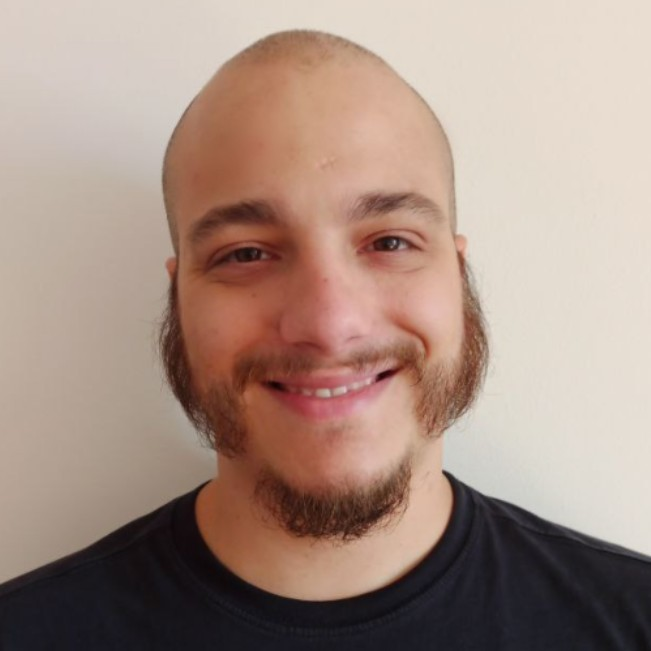
  <h5 style="margin: 0"><b>Mateus Riva</b></h5>
  
<b>Period:</b> 02/2019 - 12/2022 (PhD)

  
<b>Co-supervised with:</b> I. Bloch (Télécom Paris) and F. Yger (PSL)

  
<b>Now:</b> AI Engineer at MSD APEX.

  

  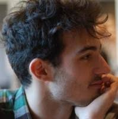
  <h5 style="margin: 0"><b>Robin Kips</b></h5>
  
<b>Period:</b> 01/2019 - 04/2022 (PhD)

  
<b>Co-supervised with:</b> I. Bloch (Télécom Paris) and M. Perrot (L'Oréal)

  
<b>Now:</b> Applied Research Scientist, Meta Reality Labs.

  

  
  <h5 style="margin: 0"><b>Corentin Mercier</b></h5>
  
<b>Period:</b> 10/2017 - 12/2020 (PhD)

  
<b>Co-supervised with:</b> I. Bloch, J.M. Thiery (Télécom Paris), D. Rohmer (LIX)

  
<b>Now:</b> Software Engineer at Pixyz.

  

  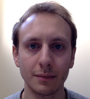
  <h5 style="margin: 0"><b>Pierre Roussillon</b></h5>
  
<b>Period:</b> 09/2018 - 11/2019 (Postdoc)

  
<b>Co-supervised with:</b> I. Bloch, J.M. Thiery (Télécom Paris)

  
<b>Now:</b> Prof. Prépa ECG at Lycée Louis Le Grand.

  

